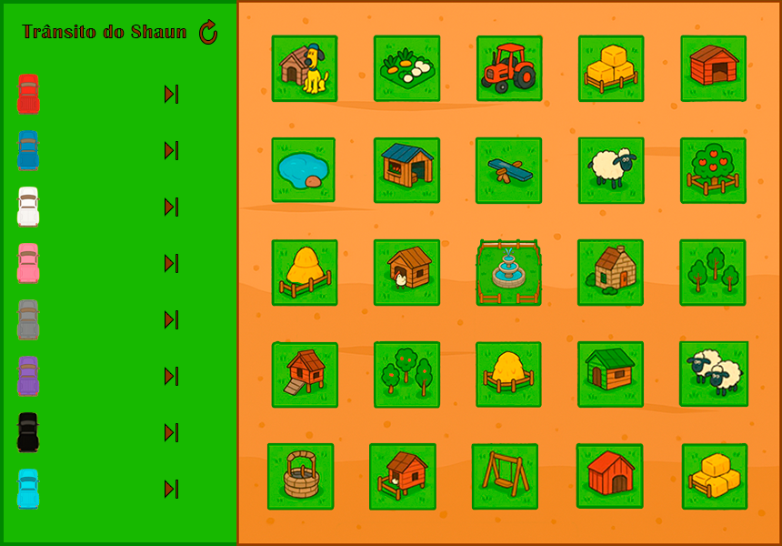

# 🚚 Trânsito Autômato — Trânsito do Shaun

Simulação visual em **JavaFX** de 8 caminhonetes coloridas percorrendo, ao
mesmo tempo, um circuito compartilhado inspirado na fazenda do Shaun o
Carneiro. Cada caminhonete roda em sua própria thread e, nos pontos onde as
rotas se cruzam, o acesso é controlado por **semáforos** — evitando colisões
entre as caminhonetes, exatamente como um cruzamento de trânsito real.



## 📖 Sobre o projeto

O projeto simula um problema clássico de concorrência aplicado a um cenário
de trânsito: várias "threads" (as caminhonetes) compartilham um mesmo espaço
físico (o circuito) e precisam coordenar o acesso aos pontos onde seus
caminhos se cruzam, sem travar o sistema (deadlock) e sem permitir colisões.

Como o circuito tem 8 caminhonetes (vermelha, azul, branca, rosa, cinza,
roxa, preta e ciano), cada par de cores que pode se cruzar em algum ponto do
trajeto tem seu próprio semáforo dedicado — controlando, par a par, quem tem
prioridade para passar por aquele ponto do circuito a cada momento.

## ✨ Funcionalidades

- 🚚 8 caminhonetes independentes, cada uma em sua própria thread, percorrendo
  o circuito em loop contínuo
- 🚦 Semáforos dedicados para cada par de rotas que se cruzam, evitando
  colisões entre as caminhonetes
- ▶️ Botão individual para iniciar cada caminhonete
- 🎚️ Slider de velocidade individual para cada caminhonete
- 🔁 Botão de reset para reposicionar todas as caminhonetes no início do
  percurso

## 🧠 Conceitos abordados

- **Threads**: cada caminhonete é uma `Thread` independente, se movendo de
  forma concorrente com as demais
- **Semáforos** (`java.util.concurrent.Semaphore`): usados para proteger cada
  ponto de cruzamento entre rotas, garantindo exclusão mútua apenas onde ela
  é realmente necessária (e não no circuito inteiro)
- **Prevenção de colisões/deadlock**: o desafio de coordenar múltiplas
  entidades concorrentes compartilhando um espaço com vários pontos de
  interseção, sem travar o sistema

## 🛠️ Tecnologias utilizadas

- **Java**
- **JavaFX** (interface gráfica, `FXML` para a tela)
- **Threads** e **`java.util.concurrent.Semaphore`** para a sincronização
  entre as caminhonetes

## 📁 Estrutura do projeto

```
Transito-Automato/
├── Principal.java                  # Classe principal (ponto de entrada da aplicação)
├── controller/
│   └── CircuitoController.java     # Controla o circuito, os semáforos de cruzamento e a interface
├── model/
│   └── Caminhonete.java            # Thread que representa o movimento de cada caminhonete
└── view/
    ├── circuito.fxml               # Layout da interface
    └── images/                     # Assets visuais (caminhonetes, cenário da fazenda, ícones)
```

## ▶️ Como executar

Pré-requisitos:
- [JDK 17+](https://adoptium.net/)
- [JavaFX SDK](https://gluonhq.com/products/javafx/) compatível com a sua versão do JDK

Pelo terminal (ajuste `<caminho-javafx-sdk>` para o local onde extraiu o JavaFX):

```bash
# Compilar
javac --module-path <caminho-javafx-sdk>/lib --add-modules javafx.controls,javafx.fxml -d bin $(find . -name "*.java")

# Copiar os recursos (fxml e imagens) para a pasta de saída
cp -r view bin/

# Executar
java --module-path <caminho-javafx-sdk>/lib --add-modules javafx.controls,javafx.fxml -cp bin Principal
```

> 💡 Alternativamente, o projeto pode ser aberto em uma IDE com suporte a
> JavaFX (Eclipse, IntelliJ IDEA ou VS Code com a extensão *Extension Pack
> for Java*), configurando o JavaFX SDK nas bibliotecas do projeto.

## 👩‍💻 Autora

**Carolina de Moraes Carneiro**
Projeto desenvolvido para a disciplina de Programação Concorrente.
